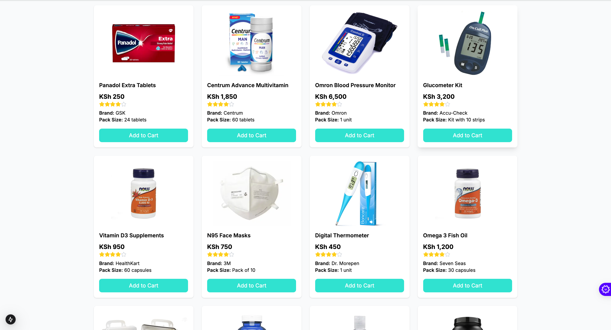
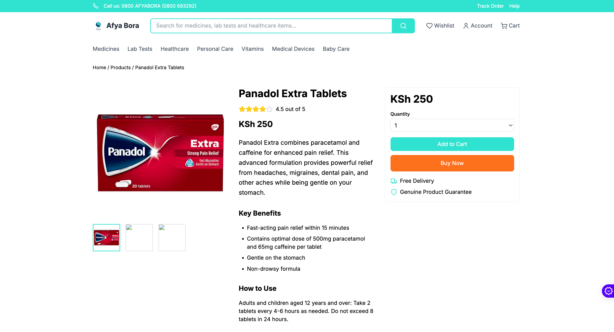
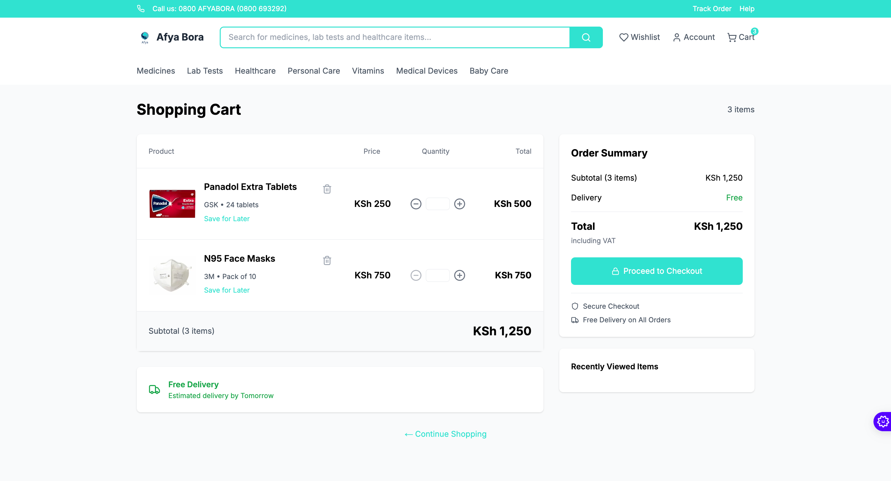
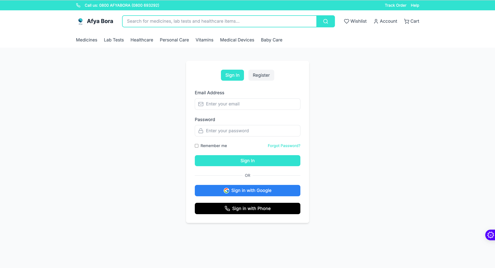

# Afya Bora - Your Trusted Online Pharmacy 🏥


Afya Bora is a modern, user-friendly online pharmacy platform built with Next.js, designed to provide accessible healthcare solutions to the community. Our platform offers a seamless experience for purchasing medications, healthcare products, and accessing professional medical advice.

## ✨ Features



- 🛒 **Easy Online Shopping** - Browse and purchase medications and healthcare products
- 💊 **Prescription Management** - Upload and manage your prescriptions securely
- 🚚 **Fast Delivery** - Quick and reliable delivery service
- 💬 **Professional Consultation** - Access to qualified healthcare professionals
- 📱 **Mobile Responsive** - Seamless experience across all devices
- 🔒 **Secure Payments** - Safe and encrypted payment processing



## 🚀 Getting Started

### Prerequisites

- Node.js (v14 or higher)
- npm or yarn
- Git

### Installation

1. Clone the repository:
```bash
git clone https://github.com/your-username/afya-bora.git
```

2. Install dependencies:
```bash
npm install
# or
yarn install
```

3. Set up environment variables:
```bash
cp .env.example .env.local
```
Update the environment variables with your configuration.

4. Run the development server:
```bash
npm run dev
# or
yarn dev
```

Open [http://localhost:3000](http://localhost:3000) to view the application.

## 🎯 Usage



1. **Browse Products**
   - Navigate through categories
   - Use search functionality
   - Filter by price, brand, etc.

2. **Managing Orders**
   - Add items to cart
   - Upload prescriptions
   - Track order status

3. **Account Management**
   - Create/login to account
   - Save delivery addresses
   - View order history

## 🛠️ Tech Stack

- **Frontend**: Next.js, React, TypeScript
- **Styling**: Tailwind CSS
- **Authentication**: Firebase
- **Database**: Prisma
- **Payment Processing**: [Your Payment Provider]

## 📱 Mobile App



Download our mobile app for an enhanced experience:
- [App Store](link-to-app-store)
- [Play Store](link-to-play-store)

## 🤝 Contributing

We welcome contributions! Please follow these steps:

1. Fork the repository
2. Create your feature branch (`git checkout -b feature/AmazingFeature`)
3. Commit your changes (`git commit -m 'Add some AmazingFeature'`)
4. Push to the branch (`git push origin feature/AmazingFeature`)
5. Open a Pull Request

## 📄 License

This project is licensed under the [MIT License](LICENSE).

## 📞 Support

- Email: support@afyabora.com
- Phone: 0800 AFYABORA (0800 693292)
- [Visit our website](https://afyabora.com)

## 🌟 Acknowledgments

- Our amazing development team
- Healthcare partners
- Open source community

---

<p align="center">Made with ❤️ by the Afya Bora Team</p>
